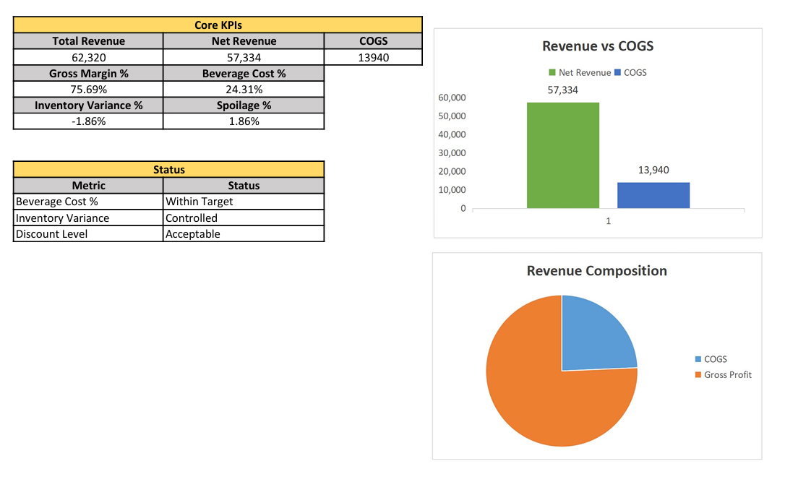

# Hospitality Cost Control & Financial Reconciliation Model (Excel)

## Overview

This project is an Excel-based operational finance simulation replicating beverage cost control processes within a hospitality outlet. The model demonstrates structured inventory tracking, cost-of-goods reconciliation, discount impact analysis, event-level monitoring, and executive KPI reporting — aligned with operational finance practices in hotel environments.

---

## Objectives

- Track daily inventory movement using roll-forward logic
- Reconcile Cost of Goods Sold (COGS) using accounting principles
- Monitor spoilage and inventory variance
- Evaluate revenue realization after discount impact
- Analyze event-level beverage consumption
- Present operational KPIs in executive dashboard format

---

## Model Structure

| Sheet Name | Purpose |
|------------|----------|
| Inventory_Ledger | Daily stock roll-forward tracking (Opening + Purchases − Sales − Spoilage = Closing) |
| COGS_Reconciliation | Monthly financial summary including COGS, gross profit, and margin analysis |
| Event_Monitoring | Expected vs actual beverage usage for simulated events |
| Dashboard | Executive KPI summary and visual performance indicators |
| Control_Checklist | Internal governance and cost-control validation framework |

## Dashboard Preview

---

## Inventory Reconciliation Logic

The model uses a structured roll-forward methodology:

Theoretical Closing = Opening
+ Purchases
− Transfers Out (Sales)
− Spoilage

Monthly COGS is calculated using:

COGS = Opening Inventory
+ Purchases
− Closing Inventory

---

## Key Metrics (Simulated Month)

| Metric | Value |
|--------|--------|
| Bottles Sold | 164 |
| Cost per Bottle | 85 AED |
| Revenue per Bottle | 380 AED |
| Total Revenue | 62,320 AED |
| Net Revenue (After 8% Discount) | 57,334 AED |
| COGS | 13,940 AED |
| Gross Profit | 43,394 AED |
| Gross Margin | 75.7% |
| Beverage Cost % | 24.3% |
| Inventory Variance | -3 bottles (-1.83%) |

---

## Event Monitoring Simulation

Two high-volume sales days were categorized as event consumption:

| Event | Expected Bottles | Actual Bottles | Variance |
|--------|------------------|----------------|----------|
| Wedding Reception | 6 | 9 | +3 |
| Corporate Dinner | 6 | 9 | +3 |

Event consumption reconciles fully with total monthly sales.

---

## Control Framework

The Control_Checklist sheet simulates operational finance governance:

- Daily inventory posting validation
- Physical stock verification
- Variance >3% investigation threshold
- Event reconciliation
- Discount level monitoring
- Purchase authorization review

---

## Financial Interpretation

- Beverage Cost % maintained within target threshold (≤25%)
- Inventory shrinkage controlled below 3% tolerance
- Margin stability maintained despite discount application
- Full reconciliation between operational movement and financial summary

---

## Skills Demonstrated

- Inventory roll-forward modeling
- COGS reconciliation logic
- Variance analysis & shrinkage quantification
- Discount-adjusted profitability modeling
- KPI dashboard development
- Operational finance control structuring

---

## Tools Used

- Microsoft Excel
- Structured financial formulas
- Conditional formatting
- KPI dashboard visualization

---

## Project Context

This simulation was developed to demonstrate operational finance capabilities relevant to hospitality cost control and inventory management roles.
